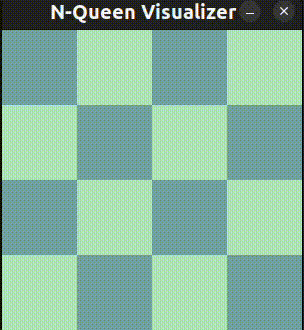

# N-Queen Backtracking Visualization

This Python program visualizes the backtracking solution to the N-Queen problem. The N-Queen problem is a classic algorithmic challenge where the goal is to place N queens on an N x N chessboard so that no two queens threaten each other.



## Prerequisites

- Python 3.x
- Pygame (for visualization)

## Setup

1. **Clone the repository:**

    ```sh
    git clone https://github.com/sumanbmondal/nqueen
    cd nqueen
    ```

2. **Install the required packages:**

    ```sh
    pip install pygame
    ```

## Usage

1. **Configure the board size:**

    Open `main.py` and update the variable `N` to change the dimensions of the N x N board.

    ```python
    N = 4  # Change this value to the desired board size
    ```

2. **Run the script:**

    ```sh
    python main.py
    ```

    This will visualize the N-Queen backtracking solution for the specified board size.

## main.py

Here is a brief overview of what `main.py` does:

- Defines the backtracking algorithm to solve the N-Queen problem.
- Visualizes the steps of the algorithm using Matplotlib.

## Contributing

Feel free to submit issues and enhancement requests.

## License

This project is licensed under the MIT License - see the [LICENSE](LICENSE) file for details.

## Acknowledgments

- [N-Queen Problem - Wikipedia](https://en.wikipedia.org/wiki/Eight_queens_puzzle)
- [Pygame](https://www.pygame.org/)
